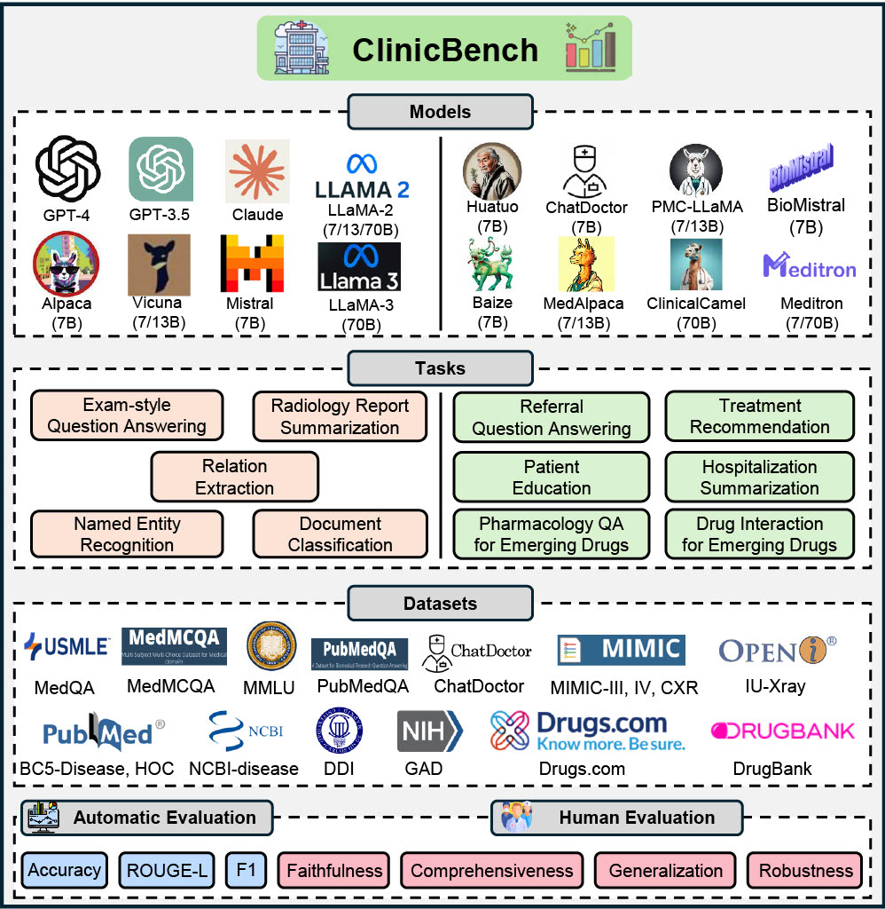

<h2 align="center"> Large Language Models Are Poor Clinical Decision-Makers: A Comprehensive Benchmark </a></h2>
<h5 align="center"> If you like our project, please give us a star ⭐ on GitHub for the latest update.</h5>

<h5 align="center">

   [](https://arxiv.org/pdf/2405.00716)
   [](https://hits.seeyoufarm.com)

</h5>

> [Large Language Models Are Poor Clinical Decision-Makers: A Comprehensive Benchmark](https://aclanthology.org/2024.emnlp-main.759.pdf)

> [Large Language Models in the Clinic: A Comprehensive Benchmark](https://arxiv.org/pdf/2405.00716)


## Abstract:

The adoption of large language models (LLMs) to assist clinicians has attracted remarkable attention. Existing works mainly adopt the close-ended question-answering (QA) task with answer options for evaluation. However, many clinical decisions involve answering open-ended questions without pre-set options. To better understand LLMs in the clinic, we construct a benchmark ClinicBench. We first collect eleven existing datasets covering diverse clinical language generation, understanding, and reasoning tasks. Furthermore, we construct six novel datasets and clinical tasks that are complex but common in real-world practice, e.g., open-ended decision-making, long document processing, and emerging drug analysis. We conduct an extensive evaluation of twenty-two LLMs under both zero-shot and few-shot settings. Finally, we invite medical experts to evaluate the clinical usefulness of LLMs.

## 🤗 What is the Clinic Benchmark About?
Clinic Benchmark provides a comprehensive benchmark of 22 LLMs in the clinic across 3 scenarios, 11 tasks, and 17 datasets. We address the following specific questions: 
1.  **Limited evaluation**: Most works only focus on evaluating LLMs in close-ended (exam-style) QA tasks, overlooking their evaluation in other scenarios, such as clinical language understanding and generation.
2.  **Limited task**: Current works primarily focus on non-clinical machine learning tasks, which cannot adequately evaluate the models’ ability to solve complex clinical problems, e.g., open-ended decision-making, long health document processing, and emerging drug analysis, all of which are very common in the clinic.
3.  **Limited comparison**: Most works either provide limited qualitative examples or use limited baselines (mainly focusing on ChatGPT) for quantitative comparisons.

<div align=center>

</div>

 ## ⚡ What insights are obtained from the Clinic Benchmark?

1. **Commercial LLMs**: Closed-source commercial LLMs, especially GPT-4, outperform all existing open-source public LLMs on all tasks and datasets.
2. **State-of-the-art (SOTA)**: LLMs achieve superior performance only on exam-style QA tasks with provided options, competing with human experts and substantially outperforming previous task-specific SOTA methods. However, LLMs perform poorly in open-ended decision-making, generation, and understanding.
3. **Medical LLMs**: Fine-tuning LLMs on medical data can improve their reasoning and understanding of medical data, but it may decrease their summarization ability. In-domain fine-tuning and few-shot prompting could be potential solutions to address this limitation.
4. **Clinical Tasks**: Existing LLMs are less effective in dealing with complex clinical tasks, demonstrating a significant drop in performance. Nevertheless, commercial LLMs drop slightly less compared to public LLMs. Medical LLMs can adapt better to clinical tasks compared to general LLMs.
5. **Few-shot Learning**: It leads to better reasoning and generation performance (i.e., 1-shot or 3-shot learning achieves the best reasoning performance and more shots consistently lead to better generation performance), but impairs the understanding performance of LLMs.
6. **Clinical usefulness**: Medical LLMs produce more factual and safe responses than general LLMs, but perform worse in generating complete and user-preferred responses. A certain degree of hallucination may offer benefits to clinicians by providing a broader spectrum of diagnostic suggestions, which could be advantageous in the diagnosis of rare diseases.
7. **Instruction Fine-tuning**: Different types of IFT data bring improvements from different aspects; more diverse IFT data can lead to better medical LLMs, highlighting the importance of improving the diversity of IFT data, which is as crucial as increasing the quantity of training data.


Overall, our results show that the close-ended QA task is the major task in which current LLMs can outperform state-of-the-art task-specific models and are comparable to human experts. However, clinical decisions often confront open-ended questions that lack pre determined answer choices. Our results further reveal that current LLMs' performance drops clearly when applied to open-ended decision-making, long document processing, and new drug understanding.

We hope that this work can offer a holistic view of LLMs in healthcare, aiming to bridge the current gaps and advance the integration of LLMs in clinical applications.
 

## 📑 Citation

Please consider citing 📑 our papers if our repository is helpful to your work, thanks sincerely!

```bibtex
@inproceedings{Liu2024ClinicBench,
  title={Large Language Models Are Poor Clinical Decision-Makers: A Comprehensive Benchmark},
  author={Fenglin Liu, Zheng Li, Hongjian Zhou, Qingyu Yin, Jingfeng Yang, Xianfeng Tang, Chen Luo, Ming Zeng, Haoming Jiang, Yifan Gao, Priyanka Nigam, Sreyashi Nag, Bing Yin, Yining Hua, Xuan Zhou, Omid Rohanian, Anshul Thakur, Lei Clifton, David A. Clifton},
  booktitle={Conference on Empirical Methods in Natural Language Processing (EMNLP)},
  year={2024}
}
```
